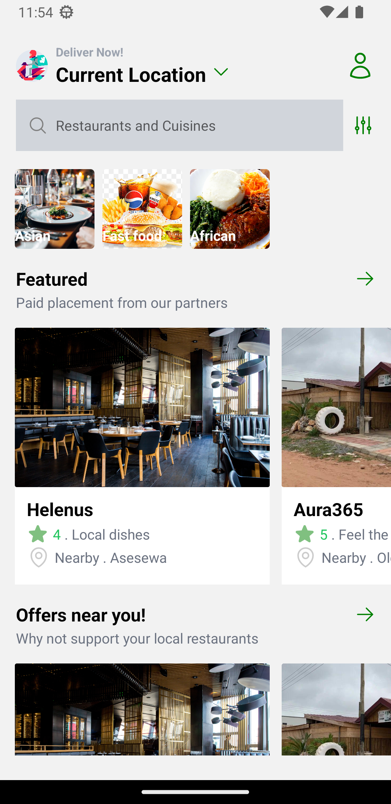
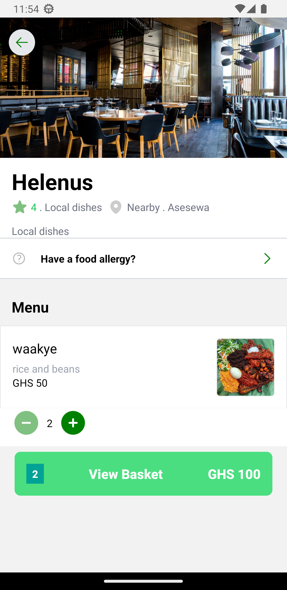
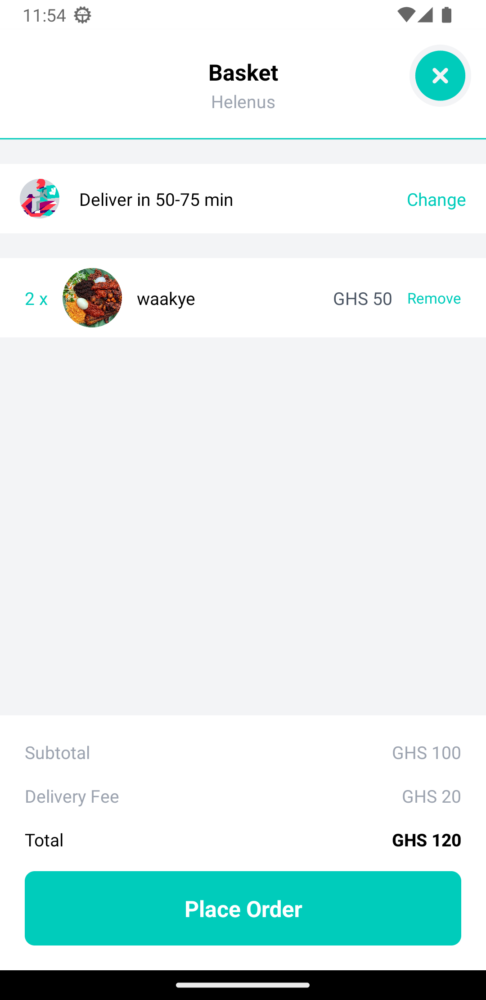
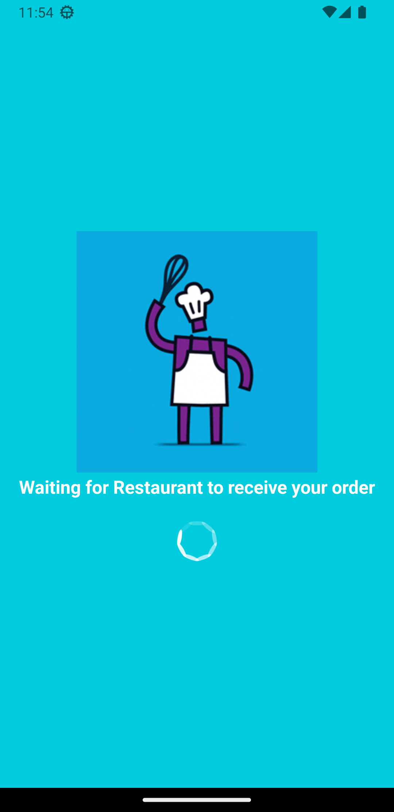
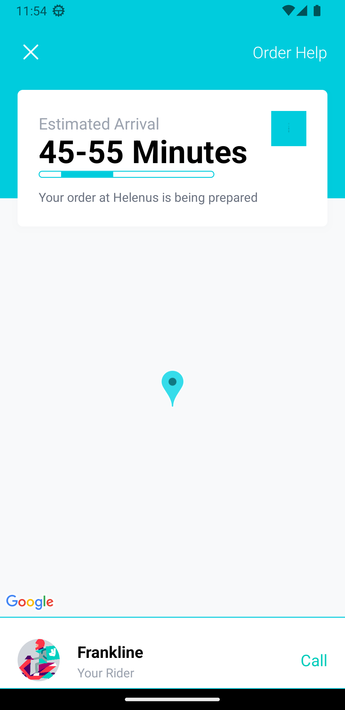

# Deliveroo-clone
# My React Native App

This mobile application is built with React Native . It uses libraries such as react-native-maps,sanity ,nativewind and Expo. 

## Technologies

- [react-native-maps](https://github.com/react-native-maps/react-native-maps): This library provides the map functionality in the app.
- [Redux-Toolkit](https://redux-toolkit.js.org/): For state management
- [Expo](https://expo.io/): An open-source platform for making universal native apps for Android, iOS, and the web with JavaScript and React.
- [Sanity](https://www.sanity.io/):content management
## Installation

First, clone the repository:

git clone https://github.com/0xNunana/Deliveroo-clone.git

Then, install the dependencies:
cd Deliveroo-clone
npm install

To start the Expo server, run:
expo start

## Images
      

